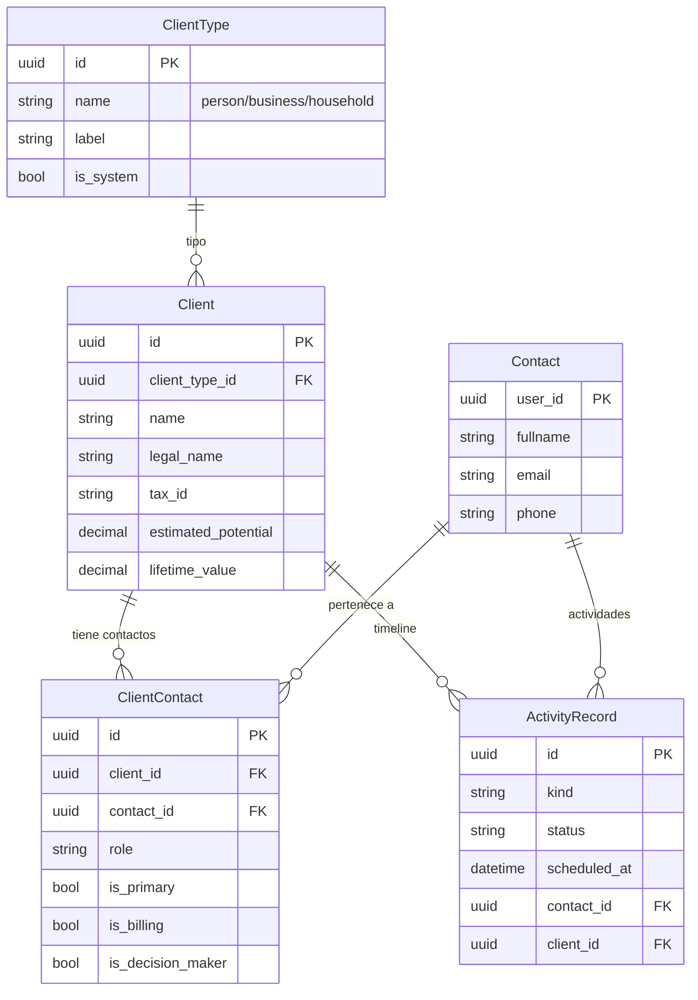
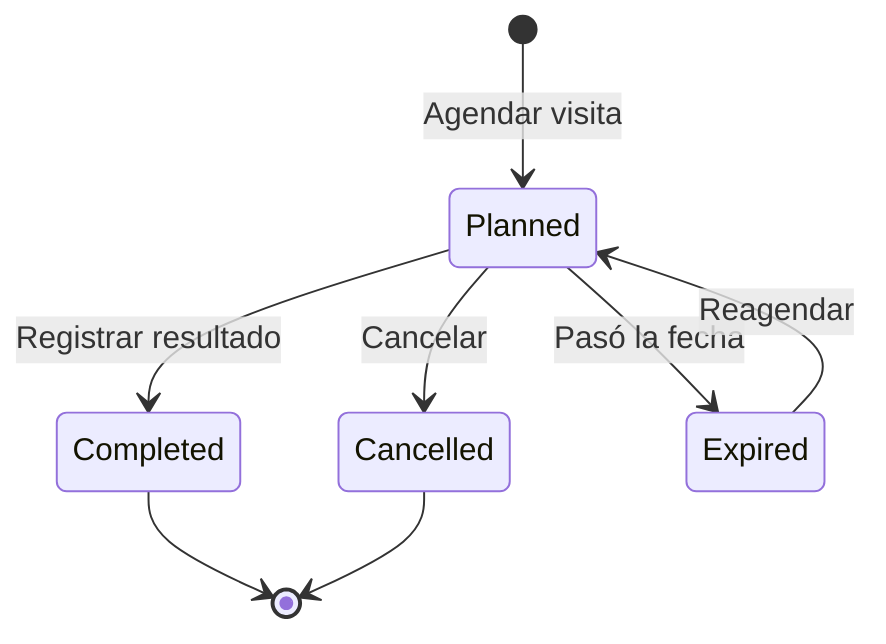

# MOIO CRM - Plan de Evolución Enero 2026

## Resumen

Evolución del modelo de datos CRM para soportar:
- Separación clara entre **Cliente** (entidad comercial) y **Contacto** (persona física)
- **ActivityRecord** como event log central del negocio
- **Status automático** del cliente basado en historial de compras
- **Timeline unificado** de todas las interacciones con el cliente

---

## 1. Modelo Cliente-Contacto

### Contexto

Actualmente `Contact` representa tanto personas como la entidad comercial principal. Esto no funciona para B2B donde:

- Un **Cliente** (empresa) tiene múltiples **Contactos** (empleados)
- Un **Contacto** puede representar a múltiples **Clientes** (ej: consultor externo)

### Arquitectura



### Modelo Client

```python
class ClientType(TenantScopedModel):
    """Tipos de cliente extensibles por tenant"""
    id = models.UUIDField(primary_key=True, default=uuid.uuid4)
    name = models.CharField(max_length=50)  # person, business, household
    label = models.CharField(max_length=100)  # Display name
    is_system = models.BooleanField(default=False)  # Tipos base no eliminables
    
class Client(TenantScopedModel):
    """Entidad comercial - puede ser persona, empresa u hogar"""
    id = models.UUIDField(primary_key=True, default=uuid.uuid4)
    client_type = models.ForeignKey(ClientType, on_delete=models.PROTECT)
    
    # Identificación
    name = models.CharField(max_length=200)  # Nombre comercial
    legal_name = models.CharField(max_length=200, blank=True)
    tax_id = models.CharField(max_length=50, blank=True)  # RUT/NIT/CUIT
    
    # Comercial
    estimated_potential = models.DecimalField(null=True)  # Facturación estimada
    
    # Campos para cálculo de status
    first_purchase_at = models.DateTimeField(null=True)
    last_purchase_at = models.DateTimeField(null=True)
    lifetime_value = models.DecimalField(default=0)
    total_deals_won = models.PositiveIntegerField(default=0)
    
    # Relación M2M con Contact
    contacts = models.ManyToManyField(
        'Contact',
        through='ClientContact',
        related_name='clients'
    )
    
    @property
    def status(self) -> str:
        """
        Status calculado automáticamente:
        - prospect: nunca compró (total_deals_won == 0)
        - active: compró en últimos 6 meses
        - churned: última compra hace más de 6 meses
        """
        if self.total_deals_won == 0:
            return "prospect"
        if self.last_purchase_at:
            months_since = (timezone.now() - self.last_purchase_at).days / 30
            if months_since <= 6:
                return "active"
        return "churned"
    
    @property  
    def status_label(self) -> str:
        labels = {
            "prospect": "Cliente Potencial",
            "active": "Cliente Activo", 
            "churned": "Ex-Cliente"
        }
        return labels.get(self.status, self.status)

class ClientContact(TenantScopedModel):
    """Relación entre Cliente y Contacto con metadata"""
    client = models.ForeignKey(Client, on_delete=models.CASCADE)
    contact = models.ForeignKey(Contact, on_delete=models.CASCADE)
    
    role = models.CharField(max_length=100, blank=True)  # CEO, Compras, Técnico
    is_primary = models.BooleanField(default=False)
    is_billing = models.BooleanField(default=False)
    is_decision_maker = models.BooleanField(default=False)
```

### Tipos de Cliente Iniciales

| name | label | is_system |
|------|-------|-----------|
| person | Persona Individual | true |
| business | Empresa | true |
| household | Hogar/Familia | true |

### Casos de Uso

**B2C (Consumidor final):**
1. Se crea Contact vía WhatsApp
2. Opcionalmente, se crea Client tipo "person" vinculando ese contacto
3. Los Deals se asocian al Client

**B2B (Empresa):**
1. Se crea Client tipo "business" con datos fiscales
2. Se crean/asocian múltiples Contacts (empleados)
3. Se marca un Contact como `is_primary` y otro como `is_decision_maker`
4. Los Deals se asocian al Client + Contact específico

**Household:**
1. Se crea Client tipo "household" 
2. Se asocian múltiples Contacts (miembros de familia)
3. Útil para seguros, servicios domiciliarios, etc.

---

## 2. Extensión de ActivityRecord

### Concepto

ActivityRecord se convierte en el **event log central** del negocio. Todo evento comercial o de soporte genera una actividad, permitiendo ver el timeline completo de un cliente.

### Cambios al Modelo

```python
# Status temporal de actividades
class ActivityStatus(models.TextChoices):
    PLANNED = "planned", "Planificada"
    COMPLETED = "completed", "Realizada"  
    CANCELLED = "cancelled", "Cancelada"
    EXPIRED = "expired", "Expirada"

# Kinds extendidos - Event Log central
class ActivityKind(models.TextChoices):
    # Existentes
    NOTE = "note", "Note"
    TASK = "task", "Task"
    IDEA = "idea", "Idea"
    EVENT = "event", "Event"
    OTHER = "other", "Other"
    
    # Ventas (registro manual)
    CALL = "call", "Llamada"
    VISIT = "visit", "Visita"
    MEETING = "meeting", "Reunión"
    PROPOSAL = "proposal", "Propuesta"
    
    # Comunicaciones (estructura para auto-generación futura)
    EMAIL_SENT = "email_sent", "Email Enviado"
    EMAIL_RECEIVED = "email_received", "Email Recibido"
    CHAT_SESSION = "chat_session", "Conversación Chat"
    
    # Soporte (estructura para auto-generación futura)
    TICKET_CREATED = "ticket_created", "Ticket Creado"
    TICKET_RESOLVED = "ticket_resolved", "Ticket Resuelto"
    
    # Comercial (estructura para auto-generación futura)
    DEAL_CREATED = "deal_created", "Oportunidad Creada"
    DEAL_WON = "deal_won", "Venta Cerrada"
    DEAL_LOST = "deal_lost", "Oportunidad Perdida"

class ActivityRecord(TenantScopedModel):
    # ... campos existentes ...
    
    # NUEVOS CAMPOS
    contact = models.ForeignKey(
        'Contact', 
        on_delete=models.SET_NULL, 
        null=True, blank=True,
        related_name='activities'
    )
    client = models.ForeignKey(
        'Client',
        on_delete=models.SET_NULL,
        null=True, blank=True,
        related_name='activities'
    )
    status = models.CharField(
        max_length=20,
        choices=ActivityStatus.choices,
        default=ActivityStatus.COMPLETED
    )
    scheduled_at = models.DateTimeField(null=True, blank=True)
```

### Schemas de Content por Kind

El campo `content` (JSONField) tiene schema validado según el `kind`:

```python
ACTIVITY_SCHEMAS = {
    "call": {
        "type": "object",
        "properties": {
            "outcome": {"type": "string", "enum": ["positive", "neutral", "negative", "no_answer"]},
            "duration_minutes": {"type": "integer"},
            "notes": {"type": "string"},
            "next_action": {"type": "string"},
            "next_action_date": {"type": "string", "format": "date"}
        },
        "required": ["outcome"]
    },
    "visit": {
        "type": "object",
        "properties": {
            "outcome": {"type": "string", "enum": ["positive", "neutral", "negative", "cancelled"]},
            "proposal_made": {"type": "string"},
            "results_obtained": {"type": "string"},
            "follow_up_tasks": {"type": "string"},
            "reflections": {"type": "string"},
            "sale_value": {"type": "number"},
            "order_reference": {"type": "string"},
            "next_action": {"type": "string"},
            "next_action_date": {"type": "string", "format": "date"}
        },
        "required": ["outcome"]
    },
    "meeting": {
        "type": "object", 
        "properties": {
            "outcome": {"type": "string"},
            "attendees": {"type": "array", "items": {"type": "string"}},
            "agenda": {"type": "string"},
            "minutes": {"type": "string"},
            "action_items": {"type": "array", "items": {"type": "object"}}
        }
    },
    "proposal": {
        "type": "object",
        "properties": {
            "proposal_value": {"type": "number"},
            "currency": {"type": "string"},
            "valid_until": {"type": "string", "format": "date"},
            "status": {"type": "string", "enum": ["sent", "viewed", "accepted", "rejected", "expired"]},
            "items": {"type": "array"}
        },
        "required": ["proposal_value"]
    }
}
```

### Flujo de Actividades



---

## 3. Vista Unificada del Cliente

### Concepto

Al ver un cliente, se muestra:
- Datos del cliente con status calculado
- Valor comercial (potencial vs real)
- Contactos con sus roles
- Timeline de todas las actividades

### Diagrama de la Vista

```
+------------------------------------------------------------------+
|  CLIENTE: Empresa ABC                      Status: ACTIVE        |
|  Tipo: Business    RUT: 214356780019       Desde: 2024-03-15     |
+------------------------------------------------------------------+
|  VALOR                                                           |
|  Potencial: $50,000/año    Lifetime: $32,500    Deals: 2 ($8.5k) |
+------------------------------------------------------------------+
|  CONTACTOS                                                       |
|  ★ Juan Pérez (Gerente) [primary] [decision_maker]               |
|  • María López (Asistente)                                       |
+------------------------------------------------------------------+
|  TIMELINE                                                        |
|  15 Ene  DEAL_CREATED   Cotización impresoras - $3,500           |
|  14 Ene  EMAIL_RECEIVED Consulta precios                         |
|  10 Ene  CHAT_SESSION   12 mensajes (Juan)                       |
|  08 Ene  VISIT          outcome: positive                        |
|  05 Ene  TICKET_RESOLVED Soporte técnico                         |
|  02 Ene  DEAL_WON       $5,000                                   |
+------------------------------------------------------------------+
```

### Parte Diario del Vendedor

Con estas extensiones, el "parte diario" se implementa como:

```python
# Actividades realizadas hoy
ActivityRecord.objects.filter(
    tenant=tenant,
    user=vendedor,
    created_at__date=date.today(),
    kind__in=['call', 'visit', 'meeting', 'proposal', 'email_sent']
).select_related('contact', 'client')

# Próximas actividades planificadas
ActivityRecord.objects.filter(
    tenant=tenant,
    user=vendedor,
    status=ActivityStatus.PLANNED,
    scheduled_at__date__gte=date.today()
).select_related('contact', 'client')
```

---

## 4. API Endpoints

### Clientes

- `GET/POST /api/v1/crm/clients/` - CRUD de clientes
- `GET /api/v1/crm/clients/{id}/` - Detalle con timeline
- `GET/POST /api/v1/crm/clients/{id}/contacts/` - Contactos de un cliente
- `POST /api/v1/crm/clients/from-contact/{contact_id}/` - Crear cliente desde contacto
- `POST /api/v1/crm/contacts/{id}/link-client/` - Asociar contacto a cliente existente

### Actividades

- APIs existentes se mantienen
- Se agregan filtros por `client`, `contact`, `status`

---

## 5. Migración de Datos

- Migrar `Contact.company` (CharField) a registros Client tipo "business"
- Migrar modelo `Company` existente a Client
- Deprecar modelo `Customer` (legacy)
- `Contact.company` se mantiene pero se depreca

---

## 6. Integración Futura (no implementar ahora)

La estructura de kinds permite que en el futuro se agreguen signals para auto-generar actividades:

```python
# Ejemplo futuro - NO implementar ahora
@receiver(post_save, sender=Deal)
def deal_to_activity(sender, instance, created, **kwargs):
    if created:
        ActivityRecord.objects.create(
            kind=ActivityKind.DEAL_CREATED,
            title=f"Nueva oportunidad: {instance.title}",
            client=instance.client,
            contact=instance.contact,
            content={"deal_id": str(instance.id), "value": float(instance.value)},
            tenant=instance.tenant
        )
```

Por ahora solo se implementa la estructura. La auto-generación se agrega incrementalmente.

---

## 7. Tareas de Implementación

1. **Crear modelos** ClientType, Client, ClientContact con status automático calculado
2. **Extender ActivityRecord** con FK contact/client, status temporal, y kinds para todos los eventos
3. **Crear schemas** de validación para content según kind
4. **Crear migración** Django con datos iniciales
5. **Crear ClientService** con lógica de status automático y timeline
6. **Crear endpoints API** para Client incluyendo vista con timeline
7. **Agregar Deal.client** FK manteniendo Deal.contact
8. **Migrar datos** existentes de Contact.company y Company a Client
